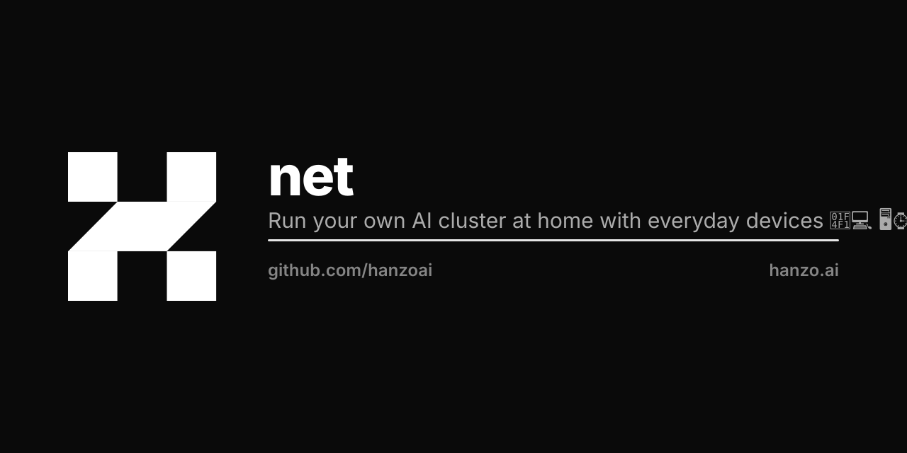

<p align="center"></p>

# Hanzo Net

Hanzo Net is a Rust workspace of 36 crates for running an AI cluster on machines you
already own — peer-to-peer over libp2p, with on-device inference, an agent and tool
runtime, post-quantum identity, and an embedded L2 that meters and settles compute.

<p>
  
  
  
</p>

## Install

The crates are on crates.io. Add the ones you need:

```bash
cargo add hanzo-vm hanzo-runtime
```

Four crates ship under a `hanzonet-*` package name, because the plain name belongs to the
Rust consumer SDK in [`hanzo-rs/sdk`](https://github.com/hanzo-rs/sdk). Rename them on the
way in, and the rest of your code reads the same:

```bash
cargo add hanzonet-pqc --rename hanzo-pqc
```

```toml
[dependencies]
hanzo-vm      = "1.1"
hanzo-runtime = "1.1"
hanzo-pqc     = { version = "1.1", package = "hanzonet-pqc" }
```

The affected four are `hanzonet-pqc`, `hanzonet-did`, `hanzonet-config` and
`hanzonet-mcp`. The Rust library name is always `hanzo_*`, so `use hanzo_pqc::…;` works
either way.

## Two things to know before you clone

- **The workspace does not build from a public clone.** `hanzo-vm` takes path dependencies
  on `../../engine/hanzo-engine` and `../../engine/hanzo-server-core`, expecting a sibling
  checkout named `engine/` that is not public. Cargo fails during workspace-manifest
  resolution, which happens before member selection, so `cargo build -p <crate>` fails the
  same way. Consuming the published crates from crates.io is unaffected — that is the
  supported path today.
- **There is no node binary here.** These are libraries; the standalone node that used to
  live in this tree is parked under `_archived-from-zoo/` and is not maintained. To run
  Hanzo models right now, use the [Hanzo CLI](https://github.com/hanzoai/cli)
  (`curl -fsSL https://hanzo.sh | sh`) against the hosted API.

## What is in here

| Layer | Crates | What it does |
|-------|--------|--------------|
| **Networking** | `hanzo-libp2p`, `hanzo-libp2p-relayer`, `hanzo-messages` | Peer-to-peer mesh, relaying for NAT traversal, typed node messaging. |
| **Identity & crypto** | `hanzo-identity`, `hanzo-did`, `hanzo-pqc`, `hanzo-zap` | Post-quantum node identity (ML-KEM, ML-DSA, SLH-DSA), DIDs, authorization. |
| **Runtime & inference** | `hanzo-runtime`, `hanzo-wasm`, `hanzo-wasm-runtime`, `hanzo-embed`, `hanzo-models`, `hanzo-model-discovery` | On-device model execution, WASM sandboxing, embeddings, model discovery. |
| **Agents & tools** | `hanzo-agentic`, `hanzo-tools`, `hanzo-tools-runner`, `hanzo-runner`, `hanzo-mcp`, `hanzo-jobs`, `hanzo-job-queue-manager` | Agent orchestration, sandboxed tool execution, Model Context Protocol, the job queue. |
| **Data & state** | `hanzo-database`, `hanzo-db-sqlite`, `hanzo-fs`, `hanzo-api`, `hanzo-http-api` | Storage, filesystem, and the node's local `/v1` HTTP surface. |
| **Cluster economics** | `hanzo-compute`, `hanzo-machine`, `hanzo-mining`, `hanzo-hmm`, `hanzo-brain` | Compute accounting, VM lifecycle, and Hamiltonian market-maker pricing across heterogeneous hardware. |
| **Settlement** | `hanzo-consensus`, `hanzo-vm`, `hanzo-l2` | Quasar BFT consensus, an EVM with post-quantum and inference precompiles, and an L2 bridge on Lux Network. |

Plus `hanzo-ai-format`, `hanzo-config` and `hanzo-runtime-tests`. The root `Cargo.toml`
has the full member list; crates.io is the public distribution for all of them. (The
per-crate mirror repositories under the `hanzonet` org are private, so links to them are
not much use to a reader here.)

## Working in the tree

Each crate owns its own tests; `cargo test -p <crate>` targets one, once the workspace
resolves — see the note above. `LLM.md` carries the layout and the conventions that apply
inside this repo.

## License

MIT © Hanzo AI, Inc. See [LICENSE](LICENSE).

---

Hanzo — the open AI cloud. [hanzo.ai](https://hanzo.ai) · [docs.hanzo.ai](https://docs.hanzo.ai)

SDKs: [Python](https://github.com/hanzoai/python-sdk) · [TypeScript](https://github.com/hanzo-js/sdk) · [Go](https://github.com/hanzo-go/sdk) · [Rust](https://github.com/hanzo-rs/sdk) · [C++](https://github.com/hanzo-cpp/sdk) · [Swift](https://github.com/hanzo-swift/sdk) · [Kotlin](https://github.com/hanzo-kt/sdk) · [umbrella](https://github.com/hanzoai/sdk)
